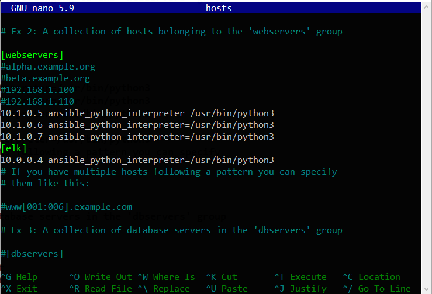
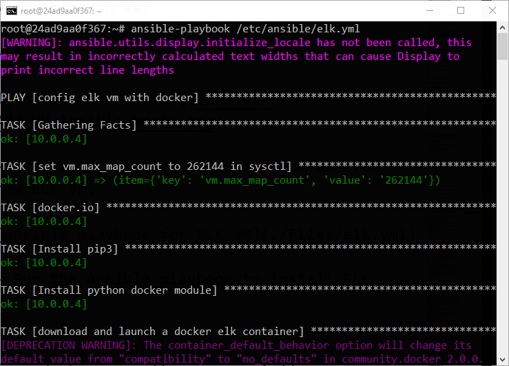
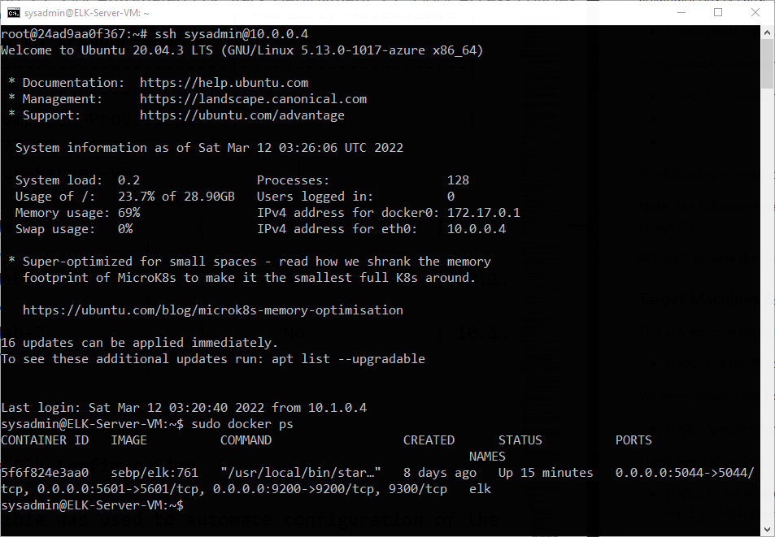

## Automated ELK Stack Deployment

The files in this repository were used to configure the network depicted below.


*[click here to view in full](./Diagram/ELK%20Deployment.png)*

These files have been tested and used to generate a live ELK deployment on Azure. They can be used to either recreate the entire deployment pictured above. Alternatively, select portions of the config file may be used to install only certain pieces of it, such as Filebeat.

   [filebeat-playbook.yml](./Ansible/filebeat-playbook.yml) 
   
   [filebeat-configuration.yml](./Ansible/filebeat-config.yml) 

This document contains the following details:
- Description of the Topology
- Access Policies
- ELK Configuration
  - Beats in Use
  - Machines Being Monitored
- How to Use the Ansible Build


### Description of the Topology

*The main purpose of this network is to expose a load-balanced and monitored instance of DVWA, the Damn Vulnerable Web Application.*

- Load balancing ensures that the application will be highly available, in addition to restricting high-traffic to the network.

- Security aspect of Load balancers :

	- It prevents servers become overloading as well as increases productivity and maximizes uptime. 
	- It also rerouts live traffic from one server to another to eliminate single points of failure from attacks such as DDoS attack.

- Advantage of a jump box :

	- Jump-boxs are highly secured and restricted computers set up with multifactor authentication and placed in a network DMZ area with no returning access for any protocol. 
	- Jump-box has only one secure connection through SSH and no other protocols are allowed to decrease the chances of hackers/malware infection. 


Integrating an ELK server allows users to easily monitor the vulnerable VMs for changes to the network and system logs.

- Filebeat watch :

	- Filebeat is used for centralizing and forwarding log data. It monitors log files of a specific system, collects log events and forward them to ELK server for elasticsearch.
 
- Metricbeat record :

	- Metricbeat takes the metrics and statistics that it collects and pushes them to the specific ELK server for elasticsearch. It monitors servers by collecting metrics from system and services running on the server.


The configuration details of each machine may be found below :

| Name                 | Function | IP Address                               | Operating System     |
|----------------------|----------|------------------------------------------|----------------------|
| Jump-Box-Provisioner | Gateway  | 10.1.0.4(Private)//13.77.57.130(Public)|     Linux            |
| ELK-Server-VM               | Server   | 10.0.0.4(Private)//20.70.27.244(Public)   |     Linux            |
| Web-1              | Web Server   | 10.1.0.5(Private)                       |     Linux            |
| Web-2              | Web Server   | 10.1.0.6(Private)                       |     Linux            |
| Web-3              | Web Server   | 10.1.0.7(Private)                       |     Linux            |

### Access Policies

The machines on the internal network are not exposed to the public Internet. 

- Only the jump-Box-Provisioner machine can accept connections from the Internet.

- Access to this machine is only allowed from the following IP addresses:
	- 194.223.56.126 (LocalHost IP address)

Machines within the network can only be accessed by Jump-Box-Provisioner

- Allowed machine to access ELK-Server-VM :
	- Jump-Box-Provisioner  

- IP address :
	- 10.1.0.4 (Private) 

- A summary of the access policies in place can be found in the table below.

| Name                  | Publicly Accessible | Allowed IP Addresses |
|-----------------------|---------------------|----------------------|
| Jump-Box-Provisioner  |       Yes           | 13.77.57.130          |
| ELK-Server-VM               |       No            | 10.0.0.4             |
| Web-1              |       No            | 10.1.0.5             |
| Web-2              |       No            | 10.1.0.6             |
| Web-3              |       No            | 10.1.0.7             |


### Elk Configuration

Ansible was used to automate configuration of the ELK machine. No configuration was performed manually, which is advantageous because...

- Main advantage of automating configuration with Ansible are as follows :

	- Very simple to setup and use.
	- No special coding skills are necessary to use Ansible playbooks. 
	- Organize the entire application environment no matter where it is deployed.    
                               
The playbook implements the following tasks:

- Steps of the ELK installation play : 

	- SSH into the Jump-Box-Provisioner 

		``ssh sysadmin@13.77.57.130``
	
	- Install ``docker.io`` on the Jump-Box

		``sudo apt update``

		``sudo apt install docker.io``

	- Verify that the Docker service is running

		``sudo systemctl status docker``

	
	- Once Docker is installed, pull the container ``cyberxsecurity/ansible``

		``sudo docker pull cyberxsecurity/ansible``

	- Launch the Ansible container and connect to it

		``sudo docker run -ti cyberxsecurity/ansible:latest``

	- Create a ssh key, then create the ELK VM with this ssh key.

	- Add new ELK VM to the Ansible ``hosts`` file
	
	

	- Create a new Ansible playbook to use for new ELK VM.

	[Ansible playbook for ELK VM](./Ansible/elk.yml)

	- Run the Ansible playbook to install ELK

	``ansible-playbook /etc/ansible/elk.yml``

	
	
The following screenshot displays the result of running `docker ps` after successfully configuring the ELK instance.



### Target Machines & Beats
This ELK server is configured to monitor the following machines:

- List of the IP addresses of the machines are being monitored

	- Web-1 (10.1.0.5)
	- Web-2 (10.1.0.6)
	- Web-3 (10.1.0.7)

- We have installed the following Beats on these machines:

	- [Filebeat (Status Screenshot)](./Images/FileBeat.png)
	- [Metricbeat (Status Screenshot)](./Images/Metricbeat.png)

- These Beats allow us to collect the following information from each machine:
	
	- #### Filebeat
	 	Filebeat is used to collect log files from a specific remote machines.

	 	Examples of Filebeats can be files that are generated by Apache, Microsoft Azure tools, the Nginx web server, and MySQl databases.	

	- #### Metricbeat 
		Metricbeat collects machine metrics data.
		It is simply a measurement to tell analysts how healthy it is.
		
		Examples of Metricbeat can be CPU usage/Uptime 

### Using the Playbook
In order to use the playbook, we need to have an Ansible control node already configured. Such a control node have been provisioned: 

SSH into the control node and follow the steps below:

- #### Filebeat

	- Download the [filebeat-configuration.yml](./Ansible/filebeat-config.yml) file to ```/etc/ansible/``` directory.
	- Update the [filebeat-configuration.yml](./Ansible/filebeat-config.yml) file to include the ELK VM's private IP (10.0.0.4) in lines #1106 and #1806.

	
	

	- Run the [playbook](./Ansible/filebeat-playbook.yml), and navigate to [http://20.70.27.244:5601](./Images/FileBeat.png) (screen shot) to check that the installation worked as expected.

- #### Metricbeat

	- Download the [metricbeat-configuration.yml](./Ansible/metricbeat-config.yml) file to ```/etc/ansible/``` direcorty.
	- Update the [metricbeat-configuration.yml](./Ansible/metricbeat-config.yml) file to include the ELK VM's private IP (10.0.0.4) in lines #62 and #96.

	
	

	- Run the [playbook](./Ansible/metricbeat-playbook.yml), and navigate to [http://20.70.27.244:5601](./Images/Metricbeat.png) (screen shot) to check that the installation worked as expected.

### Using Kibana
After setting up an ELK server we need to verify that ELK server is working as expected and pulling both logs and metrics from the pen-testing web servers.

To test our newly setup ELK server the following task has been performed :
-	#### SSH Barrage :
	To perform this task a high amount of failed SSH login had been generated and verified that Kibana is picking up this activity.

	Bash script to generate huge number of login attempts accross all 3 webservers :
	
			while true
			do for i in {5..7}
				do ssh nouser@10.1.0.$i
				done
			done
	*Note : This loop will continue to run until stop it using ```CTRL + C``` and will create thousands of login attempts.*

	

	Kibana logs

	


-	#### Linux Stress
	To perform this task we installed stress program in to each web servers and run it using the following commands :

	```sudo apt install stress```

	```sudo stress --cpu 1```

	Metrix data


-	#### wget-DoS
	For this test we generated a high number of web request to our pen-testing servers and make sure Kibana is picking them up.

	command ```while true;do for i in {5..7}; do wget -0 /dev/null 10.1.0.$i;done;done;```

	*Note : This loop will continue to run until stop it using ```CTRL + C``` and will create thousands of web requests.*

	Example of wget command 
	

	We can see below Load and Metrics of the web servers were hit.


### Bonus

#### _Following are the commands the user will need to run to download the playbook config file, update the files, create the playbook file and run the playbook file._

- #### Filebeat

	- Create and update the filebeat-configuration.yml file :
		- Download the filebeat configuration file template from provided url to the specific directory by using ```curl``` command from jumpbox ansible container.

		```https://gist.githubusercontent.com/slape/5cc350109583af6cbe577bbcc0710c93/raw/eca603b72586fbe148c11f9c87bf96a63cb25760/Filebeat > /etc/ansible/filebeat-config.yml```

		

		- Run ```nano /etc/ansible/filebeat-config.yml``` to update the [filebeat-configuration](./Ansible/filebeat-config.yml) file.

	- To create the [filebeat playbook](./Ansible/filebeat-playbook.yml) : ```nano /etc/ansible/filebeat-playbook.yml```
	
	- Command to run the playbook :  ```ansible-playbook /etc/ansible/filebeat-playbook.yml```
      
	
- #### Metricbeat 
	
	- Create and update the metricbeat-configuration.yml file :
		- Download the metricbeat configuration file template from provided url to the specific directory by using ```curl``` command from jumpbox ansible container.

		```https://gist.githubusercontent.com/slape/58541585cc1886d2e26cd8be557ce04c/raw/0ce2c7e744c54513616966affb5e9d96f5e12f73/metricbeat > /etc/ansible/metricbeat-config.yml```

		

		- Run ```nano /etc/ansible/metricbeat-config.yml``` to update the [metricbeat-configuration](./Ansible/metricbeat-config.yml) file.

	- To create the [metricbeat playbook](./Ansible/metricbeat-playbook.yml) : ```nano /etc/ansible/metricbeat-playbook.yml```
	
	- Command to run the playbook :  ```ansible-playbook /etc/ansible/metricbeat-playbook.yml```
